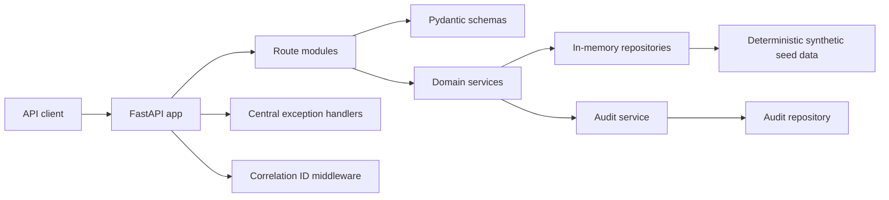
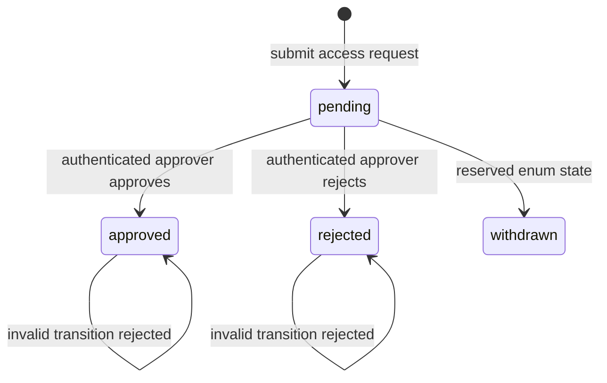

# Genomic Research Access API

This repository demonstrates a cloud-native Product Security and DevSecOps portfolio around a small FastAPI reference product for controlled access to synthetic research dataset metadata.

This repository uses synthetic, non-identifiable demonstration data only.

It is not a production genomics platform.

It is not affiliated with or endorsed by Genomics England.

AWS infrastructure is provided as non-deployed Terraform. External identity-provider integration and cloud deployment are deferred to later milestones.

## Problem Statement

Product security work is most effective when engineers have a concrete product surface to secure. This repository provides that surface: a small API with dataset catalogue, access request workflow, structured audit events, validation, stable error responses, and local quality gates.

## Milestones Delivered

Milestone 1 delivered the application foundation.

Milestone 2 delivered security architecture and threat modelling for the current application and anticipated future cloud-native context.

Milestone 3 delivered local signed JWT authentication, role-based authorisation, object-level access controls, separation of requester and approver duties, API security headers, and deterministic API-security evidence.

Milestone 4 delivered a secure AWS ECS Fargate Terraform reference architecture, local infrastructure policy tests, deterministic infrastructure evidence and cloud-security documentation. It did not deploy resources.

Milestone 5 delivered the core AppSec pipeline: pinned scanner configuration, Semgrep and Bandit SAST, project-scoped pip-audit SCA, deterministic CycloneDX SBOM evidence, Checkov IaC reporting, Gitleaks and Trivy wrapper targets, AppSec reports and SHA-pinned security workflows.

Milestone 6 adds local-only dynamic API security validation: dynamic pytest boundary tests, pinned Schemathesis OpenAPI testing, pinned OWASP ZAP baseline scanning, bounded resource-consumption checks, deterministic dynamic evidence and dynamic-security reports. Dynamic scans are restricted to localhost, loopback and approved local Docker targets.

Milestone 7 adds canonical findings normalisation and risk enrichment across threat-model, AppSec, infrastructure and dynamic-security outputs. It preserves native evidence and governed suppressions, assigns deterministic owners and SLAs, and does not implement release gates or lifecycle workflow.

Milestone 8 adds risk-based release gates over the Milestone 7 canonical findings. It produces deterministic release decisions, rule evaluations, approval requirements, action lists, risk summaries and reports. Evidence generation succeeds for blocked and conditional decisions; enforcement is a separate command. It does not deploy, push containers, create AWS resources, or implement a formal exception workflow.

Milestone 9 adds deterministic vulnerability lifecycle and exception governance over canonical findings and release outputs. It produces a vulnerability register, lifecycle history, security exception register, expiry reports, verification evidence, audit reports and a pinned lifecycle workflow. It does not start Security Champions, deploy, push containers, create AWS resources, commit or push.

Milestone 10 adds consolidated security evidence and reporting across Milestones 1-9. It produces a deterministic evidence bundle, source lineage, control coverage, security metrics, integrity summaries and audience-oriented reports. It does not start Milestone 11 developer enablement, Security Champions, dashboards, ticketing, external reporting, deployment or AWS resource creation.

Milestone 11 adds developer security enablement: repository-specific secure development guidance, pull-request security workflow, local command tiers, pre-commit integration, reusable CI examples, prerequisite checks, developer enablement evidence and reports. It does not start Security Champions, dashboards, Repository 5 integration, external ticketing, deployment or AWS resource creation.

Milestone 12 adds a local Security Champions programme: charter, role definition, onboarding, 90-day plan, monthly learning cadence, workshops, exercises, checklists, escalation model, metrics, maturity model, evidence and reports. It uses synthetic role-based records only and does not implement Repository 5 integration, dashboards, ticketing, messaging, deployment or AWS resource creation.

## Milestone 1 Scope

Implemented:

- FastAPI application using Pydantic v2 and a `src/` layout.
- Deterministic synthetic dataset catalogue.
- Access request creation, retrieval, approval, and rejection.
- Local workflow decisions for access requests.
- Structured audit events for significant actions.
- Central exception handling with correlation IDs.
- Explicit CORS configuration without wildcard origins.
- Unit, integration, and API tests with coverage enforcement.
- Dockerfile, Makefile, and GitHub Actions CI.

Not implemented in Milestone 1: production authentication, JWT/OIDC, final RBAC, object-level authorisation, AWS, Terraform, threat modelling, AppSec scanners, risk gates, vulnerability lifecycle, cloud deployment, or Security Champions programme.

## Milestone 2 Scope

Implemented:

- STRIDE-based threat model under `docs/threat-model/`.
- Machine-readable assets, actors, entry points, data flows, trust boundaries, threat register, requirements register, traceability register and residual-risk register.
- Typed validation utility: `python -m genomic_research_access_api.security.threat_model.validate`.
- Deterministic evidence outputs under `outputs/security/threat-model/`.
- Generated reports under `reports/security/`.
- Tests covering schema validation, traceability, deterministic evidence, checksums and report generation.

Not implemented in Milestone 2: production authentication, RBAC enforcement, object-level authorisation implementation, AWS resources, Terraform, AppSec scanners, release gates, vulnerability lifecycle, cloud deployment or Security Champions programme.

## Milestone 3 Scope

Implemented:

- RS256 JWT validation with issuer, audience, expiry, not-before, subject, role and JWT ID checks.
- Central authenticated principal model.
- Deny-by-default role-to-permission matrix for researcher, approver, data custodian, security auditor and application administrator roles.
- Authentication and authorisation dependencies for all `/api/v1/*` routes.
- Object-level authorisation for access requests and restricted dataset detail.
- Separation of duties preventing any requester, including an administrator, from approving or rejecting their own request.
- Mass-assignment protection by deriving requester identity from the token subject.
- Security headers, explicit CORS checks and bounded correlation ID handling.
- API-security evidence under `outputs/security/api-security/` and reports under `reports/security/`.

Not implemented in Milestone 3: external OIDC/JWKS integration, durable policy storage, production rate limiting, immutable audit logging, AWS resources, Terraform, AppSec scanners, release gates, vulnerability lifecycle, cloud deployment or Security Champions programme.

## Milestone 4 Scope

Implemented as code and local validation:

- AWS ECS Fargate behind an Application Load Balancer.
- VPC with public ALB subnets, private ECS subnets, VPC endpoints and flow logs.
- ECR with KMS encryption, immutable tags and scan-on-push.
- DynamoDB with KMS encryption, point-in-time recovery and production deletion protection.
- Secrets Manager metadata without Terraform-managed secret values.
- KMS keys for application data, secrets and audit/logging.
- CloudWatch logs, infrastructure alarms, CloudTrail and private S3 audit storage.
- Separate deployment, GitHub OIDC, task execution, runtime and flow-log roles.
- Terraform dev/prod environment separation.
- Infrastructure policy tests and deterministic evidence.

Not implemented in Milestone 4: Terraform apply, AWS deployment, Cognito, external OIDC discovery, live DNS, Route 53, ACM issuance, WAF rules, scanner pipelines, release gates, vulnerability lifecycle or Security Champions programme.

## Milestone 5 Scope

Implemented as local pipeline configuration and evidence:

- Pinned scanner inventory under `security/config/tools.yaml`.
- Gitleaks configuration with a narrowly governed test-fixture suppression.
- Custom Semgrep rules with unit tests for requester identity, Authorization logging, JWT algorithms and `shell=True`.
- Bandit SAST with medium/high policy thresholds.
- Project-scoped pip-audit dependency scanning.
- Deterministic CycloneDX SBOM generation and validation.
- Checkov Terraform scanning with findings captured as AppSec evidence.
- Trivy container scan wrapper using a pinned container image when no local binary exists.
- AppSec evidence under `outputs/security/appsec/` and reports under `reports/security/`.
- Separate SHA-pinned GitHub Actions workflows for AppSec, container security and Terraform security.

Not implemented in Milestone 5: vulnerability triage workflow, release approval gates, artifact signing/provenance, cloud deployment, scanner dashboards, Security Champions programme or AWS resource creation.

## Milestone 8 Scope

Implemented as local release-assurance policy and evidence:

- Versioned release policy, gate rules, environment policy, approval policy and severity override configuration under `config/release/`.
- Deterministic release gate evaluation over canonical findings.
- Decision values: `pass`, `conditional_pass`, `warn` and `block`.
- Rule outcomes: `matched`, `not_matched`, `not_applicable`, `suppressed` and `deferred`.
- Release evidence under `outputs/security/release/` and Markdown reports under `reports/security/`.
- Approval fixtures for enforcement validation.
- A release-assurance CI workflow that runs evidence mode only.

Not implemented in Milestone 8: formal exception workflow, deployment approval system, vulnerability lifecycle ownership process, artefact signing/provenance, AWS deployment, container push or production release automation.

## Milestone 9 Scope

Implemented as local governance, evidence and reports:

- Controlled vulnerability lifecycle states and transition policy.
- Deterministic vulnerability register generated from canonical findings.
- Role-based history entries without personal actor identifiers.
- Verification-before-closure enforcement.
- False-positive governance with rationale and evidence.
- Formal time-bound security exceptions for risk acceptance and deferral.
- Exception expiry, expiring-soon and expired-exception outputs.
- Lifecycle evidence manifest with deterministic checksums.
- Lifecycle Markdown reports and a pinned CI workflow.

Not implemented in Milestone 9: Security Champions, production ticketing integration, deployment approvals, artefact signing/provenance, AWS deployment, container push or production vulnerability-management operations.

## Milestone 10 Scope

Implemented as local evidence aggregation and reports:

- Explicit source registry for threat model, API security, infrastructure, AppSec, dynamic security, findings, release assurance and lifecycle evidence.
- Deterministic consolidated evidence bundle and manifest.
- Evidence lineage, control coverage, metrics and integrity summaries.
- Executive, product-security, engineering and audit reports.
- Sensitive-content validation for consolidated outputs.
- A security-evidence CI workflow with minimal permissions and no AWS credentials.

Not implemented in Milestone 10: Milestone 11 developer enablement, Security Champions, dashboards, ticketing, external reporting systems, regulatory certification, AWS deployment or production monitoring.

## API Capabilities

- `GET /health`
- `GET /api/v1/datasets`
- `GET /api/v1/datasets/{dataset_id}`
- `POST /api/v1/access-requests`
- `GET /api/v1/access-requests`
- `GET /api/v1/access-requests/{request_id}`
- `POST /api/v1/access-requests/{request_id}/approve`
- `POST /api/v1/access-requests/{request_id}/reject`
- `GET /api/v1/audit-events`

`GET /api/v1/audit-events` is a local demonstration endpoint for Milestone 1. It is not presented as a recommended production audit retrieval pattern.

## Architecture

The code separates API routes, schemas, domain models, services, repositories, configuration, audit handling, logging, seed data, and exception handling.





## Local Setup

Requires Python 3.11 or later.

```bash
make setup
make run
```

Open `http://127.0.0.1:8000/docs` for FastAPI's local OpenAPI UI.

## Developer Security Quick Start

Start with `docs/developer-security/README.md`.

```bash
make setup
make security-doctor
make quality
make appsec-fast
make findings-full
make release-full
make lifecycle-full
make evidence-full
```

Use `make dynamic-full` for API boundary changes and `make appsec-full` for dependency, Docker, Terraform or scanner-policy changes. Use `make security-assurance-full` before high-risk review. Developer enablement evidence is generated with `make developer-enablement-full` under `outputs/security/developer-enablement/`. Security Champions evidence is generated with `make champions-full` under `outputs/security/champions/`.

Pull requests should use `.github/pull_request_template.md`, identify security impact, list local commands run, explain finding changes, distinguish scanner suppressions from formal exceptions and state the current release-gate outcome.

## Makefile Commands

- `make setup`: create `.venv` and install runtime plus dev dependencies.
- `make install`: install dependencies into an existing `.venv`.
- `make format`: run Ruff formatter and safe lint fixes.
- `make format-check`: verify canonical formatting.
- `make lint`: run Ruff linting.
- `make type-check`: run mypy.
- `make test`: run pytest.
- `make test-coverage`: run pytest with coverage threshold.
- `make auth-test`: run focused authentication security tests.
- `make api-security-test`: run API authentication and authorisation security tests.
- `make terraform-fmt-check`: verify Terraform formatting if Terraform is installed.
- `make terraform-init`: run `terraform init -backend=false` for dev/prod if Terraform is installed.
- `make terraform-validate`: validate dev/prod Terraform if Terraform is installed.
- `make infrastructure-test`: run local infrastructure policy tests without AWS credentials.
- `make verify-infrastructure-evidence`: verify deterministic infrastructure evidence.
- `make security-tools`: print pinned AppSec scanner inventory.
- `make findings-full`: normalise existing security evidence into canonical findings, validate deterministic evidence and generate findings reports.
- `make release-policy-validate`: validate release policy, approval roles, environments and gate-rule syntax.
- `make release-gate-evaluate`: evaluate the release gate in evidence mode.
- `make release-evidence`: generate deterministic release-assurance evidence.
- `make verify-release-evidence`: verify release evidence checksums and determinism.
- `make release-report`: generate release-assurance Markdown reports.
- `make release-full`: generate, verify and report release-assurance evidence.
- `make release-gate-enforce`: enforce the current release decision and return nonzero for block or missing conditional approvals.
- `make lifecycle-policy-validate`: validate lifecycle, transition, verification, exception, ownership and role policy.
- `make lifecycle-initialise`: initialise the vulnerability register from canonical findings.
- `make lifecycle-validate`: validate lifecycle records and exception references.
- `make lifecycle-expiry`: evaluate exception expiry and lifecycle reactivation state.
- `make lifecycle-evidence`: generate deterministic lifecycle evidence.
- `make verify-lifecycle-evidence`: verify lifecycle evidence checksums and determinism.
- `make lifecycle-report`: generate lifecycle governance reports.
- `make lifecycle-full`: verify findings and release evidence, then run the full lifecycle workflow.
- `make evidence-source-validate`: validate all consolidated evidence source manifests.
- `make evidence-aggregate`: aggregate source evidence into a deterministic bundle preview.
- `make evidence-generate`: write consolidated evidence outputs.
- `make verify-consolidated-evidence`: verify consolidated evidence checksums and content safety.
- `make evidence-report`: generate consolidated reports.
- `make evidence-full`: verify source evidence, generate consolidated evidence, verify it and write reports.
- `make security-assurance-full`: run quality, source evidence, findings, release, lifecycle and consolidated evidence workflows.
- `make security-doctor`: report local developer-security prerequisite readiness without installing software.
- `make developer-docs-validate`: validate developer guides, local links and referenced commands.
- `make developer-enablement-full`: validate developer security guidance, generate enablement evidence and generate developer reports.
- `make champions-full`: validate the Security Champions programme, derive metrics from local evidence, verify the manifest and generate champion reports.
- `make secrets-scan`: run Gitleaks via local binary or pinned container.
- `make semgrep-test`: run Semgrep custom rule tests.
- `make sast`: run Semgrep and Bandit.
- `make sca`: run dependency audit and SBOM validation.
- `make checkov-scan`: run Checkov and record Terraform findings.
- `make container-build-security`: build the local image for scanning.
- `make container-scan`: run Trivy against the local image.
- `make dynamic-fast`: run local dynamic pytest security tests.
- `make dynamic-full`: run dynamic pytest, Schemathesis, ZAP, evidence verification and reports.
- `make appsec-evidence`: generate deterministic AppSec evidence.
- `make verify-appsec-evidence`: verify AppSec evidence checksums and SBOM shape.
- `make quality`: run format, lint, type, coverage, auth, API-security, infrastructure and evidence checks.
- `make run`: start the local API on `127.0.0.1:8000`.
- `make docker-build`: build the local Docker image.
- `make docker-run`: run the local Docker image.
- `make clean`: remove local generated caches.

## Docker Usage

```bash
make docker-build
make docker-run
```

The image uses `python:3.11.13-slim-bookworm`, a non-root runtime user, an explicit command, and a local health check. No secrets or cloud credentials are embedded.

## Testing

```bash
make quality
```

Tests cover health, dataset lookup, unknown resources, access request workflow, audit events, structured errors, correlation IDs, OpenAPI generation, deterministic seed data and threat-model traceability.

## Threat Model Commands

```bash
make threat-model-validate
make threat-model-evidence
make verify-threat-model-evidence
make threat-model-report
```

`make quality` validates the threat model and verifies committed evidence. It does not regenerate tracked evidence unexpectedly.

## Local JWT Development

The local API accepts signed RS256 JWTs using synthetic test keys under `tests/fixtures/keys/`. These keys are for local development and tests only.

```bash
make dev-token-researcher
make dev-token-approver
make dev-token-auditor
```

Use the emitted token as `Authorization: Bearer <token>` for `/api/v1/*` routes. `/health` and local OpenAPI docs remain unauthenticated.

## API Security Commands

```bash
make auth-test
make api-security-test
make api-security-evidence
make verify-api-security-evidence
make api-security-report
```

## AppSec Pipeline Commands

```bash
make security-tools
make semgrep-test
make sast
make sca
make checkov-scan
make appsec-evidence
make verify-appsec-evidence
make appsec-report
```

`make secrets-scan`, `make container-build-security` and `make container-scan` require either native scanner binaries or a running Docker daemon for pinned container fallbacks.

## Threat Model Evidence

Generated outputs:

- `outputs/security/threat-model/validated-threat-register.json`
- `outputs/security/threat-model/validated-security-requirements.json`
- `outputs/security/threat-model/validated-control-traceability.json`
- `outputs/security/threat-model/validated-residual-risk-register.json`
- `outputs/security/threat-model/threat-model-summary.json`
- `outputs/security/threat-model/evidence-manifest.json`

Generated reports:

- `reports/security/threat-model-report.md`
- `reports/security/security-requirements-report.md`
- `reports/security/control-traceability-report.md`
- `reports/security/residual-risk-report.md`

## API Security Evidence

Generated outputs:

- `outputs/security/api-security/authentication-control-summary.json`
- `outputs/security/api-security/authorisation-matrix.json`
- `outputs/security/api-security/endpoint-security-inventory.json`
- `outputs/security/api-security/negative-test-summary.json`
- `outputs/security/api-security/audit-control-summary.json`
- `outputs/security/api-security/api-security-summary.json`
- `outputs/security/api-security/evidence-manifest.json`

Generated reports:

- `reports/security/api-security-report.md`
- `reports/security/authentication-report.md`
- `reports/security/authorisation-report.md`
- `reports/security/negative-security-testing-report.md`

## Infrastructure Evidence

Generated outputs:

- `outputs/security/infrastructure/architecture-inventory.json`
- `outputs/security/infrastructure/iam-role-inventory.json`
- `outputs/security/infrastructure/iam-policy-summary.json`
- `outputs/security/infrastructure/network-security-summary.json`
- `outputs/security/infrastructure/encryption-control-summary.json`
- `outputs/security/infrastructure/logging-and-audit-summary.json`
- `outputs/security/infrastructure/terraform-validation-summary.json`
- `outputs/security/infrastructure/infrastructure-security-summary.json`
- `outputs/security/infrastructure/evidence-manifest.json`

Generated reports:

- `reports/security/aws-architecture-report.md`
- `reports/security/terraform-security-report.md`
- `reports/security/iam-security-report.md`
- `reports/security/infrastructure-validation-report.md`

## Repository Structure

```text
src/genomic_research_access_api/
├── api/
├── audit/
├── data/
├── domain/
├── exceptions/
├── logging/
├── repositories/
├── schemas/
├── services/
├── config.py
├── main.py
└── version.py
```

## Data Safety

The seed catalogue contains deterministic, synthetic, non-identifiable dataset metadata only. It does not contain individual-level genomic records, patient records, NHS data, real credentials, or real cloud configuration.

## Security Posture

Current implemented controls include schema validation, field length limits, stable error responses, explicit CORS allow-listing, structured audit events, correlation ID propagation, invalid workflow transition rejection, non-root container runtime configuration, pinned dependencies, CI quality checks and threat-model traceability validation.

Milestone 3 also implements local signed JWT authentication, RBAC, object-level authorisation, separation of requester and approver duties, audit-event access restrictions, security headers and API-security evidence verification.

Milestone 4 adds secure AWS Terraform configuration for private ECS, least-privilege role separation, encrypted DynamoDB/Secrets/CloudTrail storage, CloudWatch/CloudTrail observability and secure remote-state design. These controls are configured and locally validated, not deployed.

Planned future controls include external IdP integration, production rate limiting, Repository 5 integration and enterprise reporting.

This repository does not claim production-grade identity, monitoring, cloud deployment, vulnerability-management workflow or release-gate coverage.

## Limitations

State is in memory and resets when the app restarts. JWT keys under `tests/fixtures/keys/` are synthetic local development material only. Audit retrieval is a local demonstration endpoint restricted by role. Terraform is a non-deployed reference architecture; no AWS resource is created by the repository state. Threat-model risk ratings are qualitative portfolio artefacts, not production risk acceptances.

## Future Milestones

Later milestones may add external identity-provider integration, Repository 5 integration and enterprise reporting.
