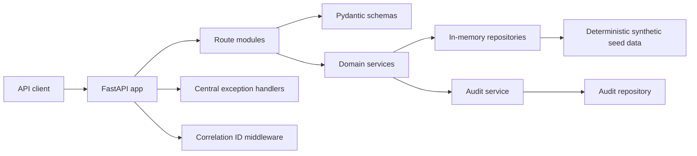
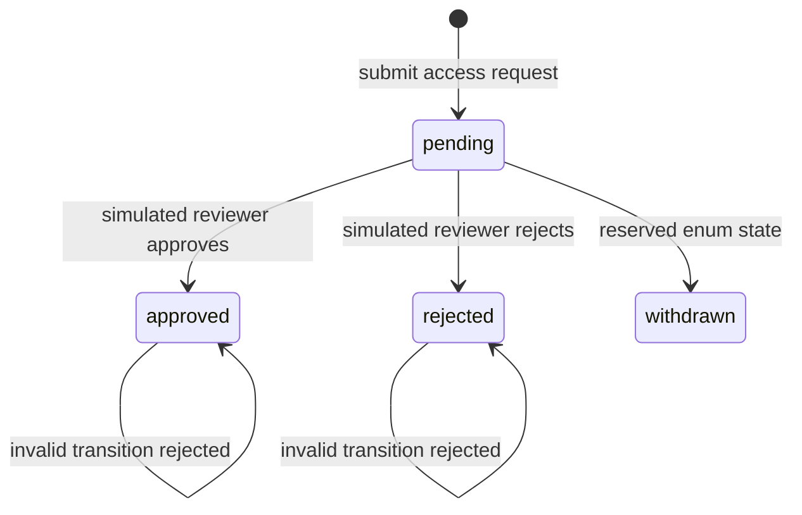

# Genomic Research Access API

This repository demonstrates Milestone 1 of a cloud-native Product Security and DevSecOps portfolio: a secure foundation and small FastAPI reference product for controlled access to synthetic research dataset metadata.

This repository uses synthetic, non-identifiable demonstration data only.

It is not a production genomics platform.

It is not affiliated with or endorsed by Genomics England.

Authentication, production authorisation, AWS infrastructure and automated AppSec scanning are intentionally deferred to later milestones.

## Problem Statement

Product security work is most effective when engineers have a concrete product surface to secure. This repository provides that surface: a small API with dataset catalogue, access request workflow, structured audit events, validation, stable error responses, and local quality gates.

## Milestone 1 Scope

Implemented:

- FastAPI application using Pydantic v2 and a `src/` layout.
- Deterministic synthetic dataset catalogue.
- Access request creation, retrieval, approval, and rejection.
- Local simulated reviewer context for workflow decisions.
- Structured audit events for significant actions.
- Central exception handling with correlation IDs.
- Explicit CORS configuration without wildcard origins.
- Unit, integration, and API tests with coverage enforcement.
- Dockerfile, Makefile, and GitHub Actions CI.

Not implemented in Milestone 1: production authentication, JWT/OIDC, final RBAC, object-level authorisation, AWS, Terraform, threat modelling, AppSec scanners, risk gates, vulnerability lifecycle, cloud deployment, or Security Champions programme.

## API Capabilities

- `GET /health`
- `GET /api/v1/datasets`
- `GET /api/v1/datasets/{dataset_id}`
- `POST /api/v1/access-requests`
- `GET /api/v1/access-requests`
- `GET /api/v1/access-requests/{request_id}`
- `POST /api/v1/access-requests/{request_id}/approve`
- `POST /api/v1/access-requests/{request_id}/reject`
- `GET /api/v1/audit-events`

`GET /api/v1/audit-events` is a local demonstration endpoint for Milestone 1. It is not presented as a recommended production audit retrieval pattern.

## Architecture

The code separates API routes, schemas, domain models, services, repositories, configuration, audit handling, logging, seed data, and exception handling.





## Local Setup

Requires Python 3.11 or later.

```bash
make setup
make run
```

Open `http://127.0.0.1:8000/docs` for FastAPI's local OpenAPI UI.

## Makefile Commands

- `make setup`: create `.venv` and install runtime plus dev dependencies.
- `make install`: install dependencies into an existing `.venv`.
- `make format`: run Ruff formatter and safe lint fixes.
- `make format-check`: verify canonical formatting.
- `make lint`: run Ruff linting.
- `make type-check`: run mypy.
- `make test`: run pytest.
- `make test-coverage`: run pytest with coverage threshold.
- `make quality`: run format, lint, type, and coverage checks.
- `make run`: start the local API on `127.0.0.1:8000`.
- `make docker-build`: build the local Docker image.
- `make docker-run`: run the local Docker image.
- `make clean`: remove local generated caches.

## Docker Usage

```bash
make docker-build
make docker-run
```

The image uses `python:3.11.13-slim-bookworm`, a non-root runtime user, an explicit command, and a local health check. No secrets or cloud credentials are embedded.

## Testing

```bash
make quality
```

Tests cover health, dataset lookup, unknown resources, access request workflow, audit events, structured errors, correlation IDs, OpenAPI generation, and deterministic seed data.

## Repository Structure

```text
src/genomic_research_access_api/
├── api/
├── audit/
├── data/
├── domain/
├── exceptions/
├── logging/
├── repositories/
├── schemas/
├── services/
├── config.py
├── main.py
└── version.py
```

## Data Safety

The seed catalogue contains deterministic, synthetic, non-identifiable dataset metadata only. It does not contain individual-level genomic records, patient records, NHS data, real credentials, or real cloud configuration.

## Security Posture

Milestone 1 provides secure local defaults and clean extension points. It does not claim production-grade identity, authorisation, monitoring, or scanner coverage.

## Limitations

State is in memory and resets when the app restarts. The approval actor is a documented local simulation. Audit retrieval is a local demonstration endpoint.

## Future Milestones

Later milestones may add authentication, object-level authorisation, threat modelling, CI/CD security controls, AWS/Terraform security, vulnerability management, risk-based release gates, and Security Champions enablement.
