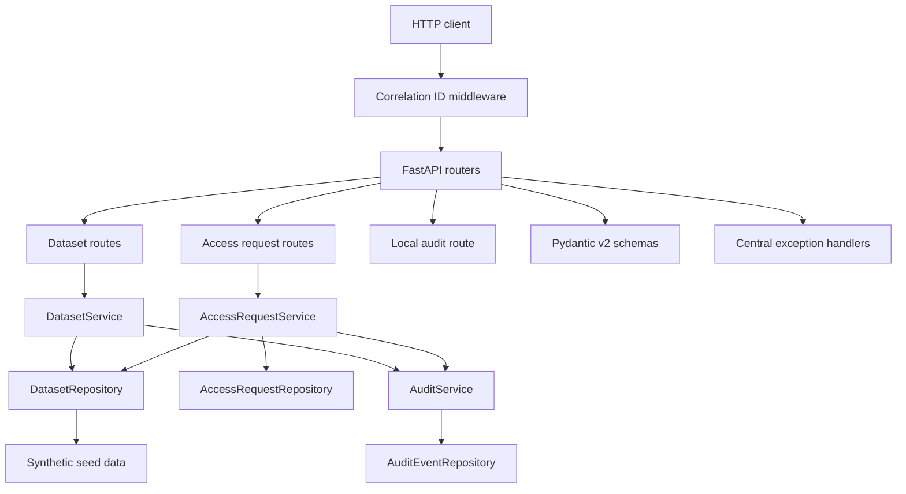
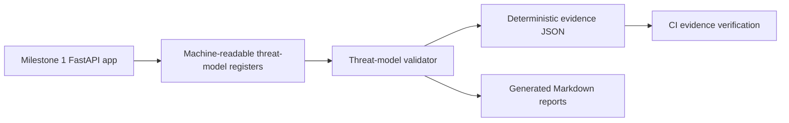

# Application Architecture

Milestone 1 implements a small FastAPI service named Genomic Research Access API. It uses deterministic synthetic data and in-memory repositories so the full application remains runnable locally with no AWS account or external service.

## Boundaries

- Routes handle HTTP concerns only.
- Schemas handle request and response validation.
- Domain models and enums define controlled business concepts.
- Services enforce workflow behavior.
- Repositories encapsulate in-memory persistence.
- Audit handling records structured events without logging sensitive request content.
- Configuration keeps local secure defaults and avoids wildcard CORS.

## Extension Points

The repository and service boundaries are intentionally simple. Later milestones can replace in-memory persistence, add real identity, enforce object-level authorisation, and attach scanner or cloud controls without redesigning the Milestone 1 API foundation.

## Milestone 2 Security Architecture

Milestone 2 adds a validated threat model without changing runtime API behaviour.

The threat model analyses both the current local implementation and anticipated cloud-native context. Future identity, AWS, Terraform and scanner controls are modelled as planned controls only.
