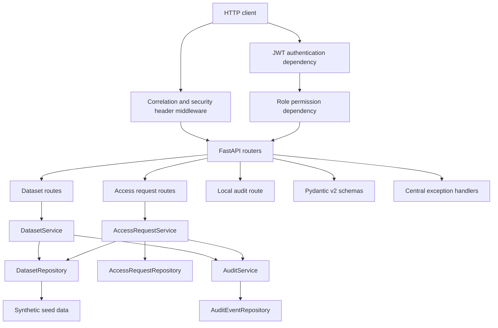
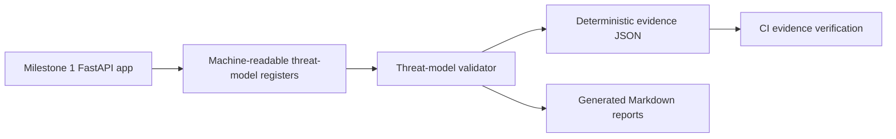

# Application Architecture

The repository implements a small FastAPI service named Genomic Research Access API. It uses deterministic synthetic data and in-memory repositories so the full application remains runnable locally with no AWS account or external service.

## Boundaries

- Routes handle HTTP concerns only.
- Schemas handle request and response validation.
- Domain models and enums define controlled business concepts.
- Services enforce workflow behavior.
- Repositories encapsulate in-memory persistence.
- Audit handling records structured events without logging sensitive request content.
- Configuration keeps local secure defaults and avoids wildcard CORS.
- Authentication validates local RS256 JWTs and exposes a central principal.
- Authorisation maps roles to permissions and applies object-level checks in services.

## Extension Points

The repository and service boundaries are intentionally simple. Later milestones can replace in-memory persistence, integrate an external identity provider, attach scanner or cloud controls, and add durable policy storage without redesigning the API foundation.

## Milestone 2 Security Architecture

Milestone 2 adds a validated threat model without changing runtime API behaviour.

The threat model analyses both the current local implementation and anticipated cloud-native context. Future identity, AWS, Terraform and scanner controls are modelled as planned controls only.

## Milestone 3 API Security Architecture

```mermaid
flowchart LR
    Request["/api/v1 request"] --> Bearer["Authorization bearer token"]
    Bearer --> Validator["RS256 JWT validator"]
    Validator --> Principal["AuthenticatedPrincipal"]
    Principal --> Permission["Role-to-permission matrix"]
    Permission --> Route["Protected route"]
    Route --> ObjectRule["Object-level service rule"]
    ObjectRule --> Audit["Security audit event"]
```

All `/api/v1/*` routes require authentication and explicit permissions. `/health` and local OpenAPI documentation remain public for local development. Restricted dataset detail and access-request resources are checked per object; unauthorised object access returns a not-found style response to avoid confirming resource existence.
