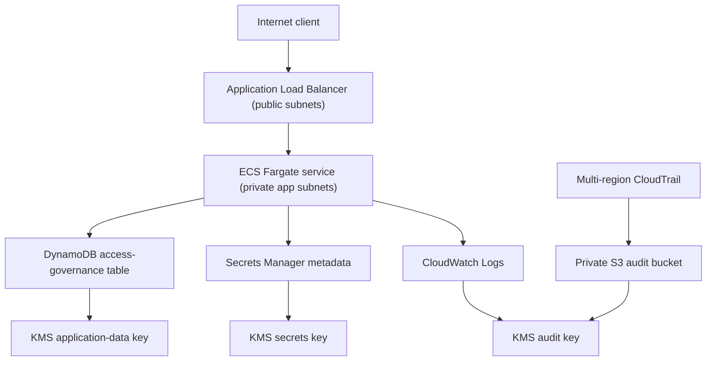
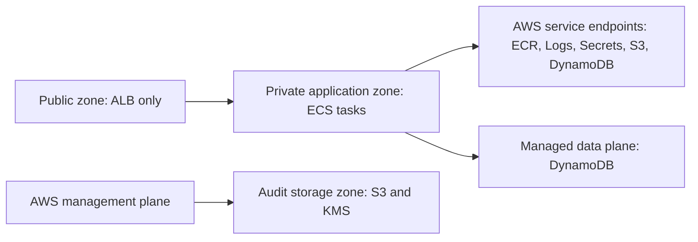

# AWS Reference Architecture

Milestone 4 defines a non-deployed AWS ECS Fargate reference architecture. The Terraform is locally validated as configuration only; no AWS resources are created by this repository state.

## Trust Zones

## Deployment Boundary

Terraform files are a deployment blueprint. This milestone does not run `terraform apply`, publish images, create certificates, configure DNS, create WAF rules, or configure live AWS credentials.

## Security Scanning

Milestone 5 adds Checkov scanning for the Terraform reference architecture. Findings are captured in `outputs/security/appsec/iac-scan-summary.json` and are intentionally not hidden behind broad suppressions.
