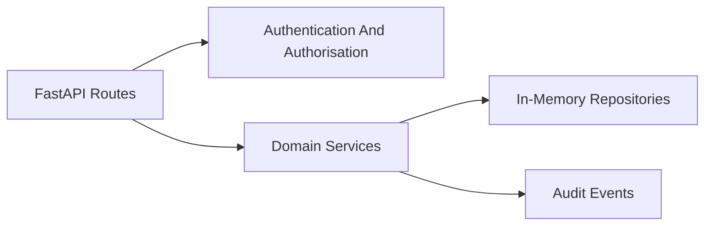

# Application Architecture

```mermaid
flowchart LR
    Routes["FastAPI Routes"] --> Auth["Authentication And Authorisation"]
    Routes --> Services["Domain Services"]
    Services --> Repositories["In-Memory Repositories"]
    Services --> Audit["Audit Events"]
```

Boundary: local FastAPI application and tests.

Evidence: `tests/security/test_api_security_controls.py`, `outputs/security/api-security/evidence-manifest.json`.
