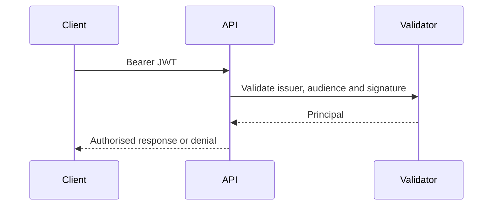

# Authentication Flow

```mermaid
sequenceDiagram
    participant Client
    participant API
    participant Validator
    Client->>API: Bearer JWT
    API->>Validator: Validate issuer, audience and signature
    Validator-->>API: Principal
    API-->>Client: Authorised response or denial
```

Boundary: local signed JWT validation only.

Evidence: `docs/developer-security/authentication-guide.md`, `tests/security/test_api_security_controls.py`.
