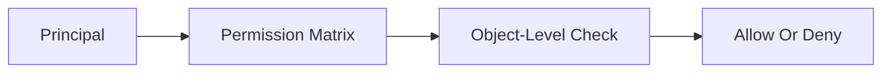

# Authorisation Flow

```mermaid
flowchart LR
    Principal["Principal"] --> Permission["Permission Matrix"]
    Permission --> Object["Object-Level Check"]
    Object --> Decision["Allow Or Deny"]
```

Boundary: local role and object-access checks.

Evidence: `docs/developer-security/authorisation-guide.md`.
