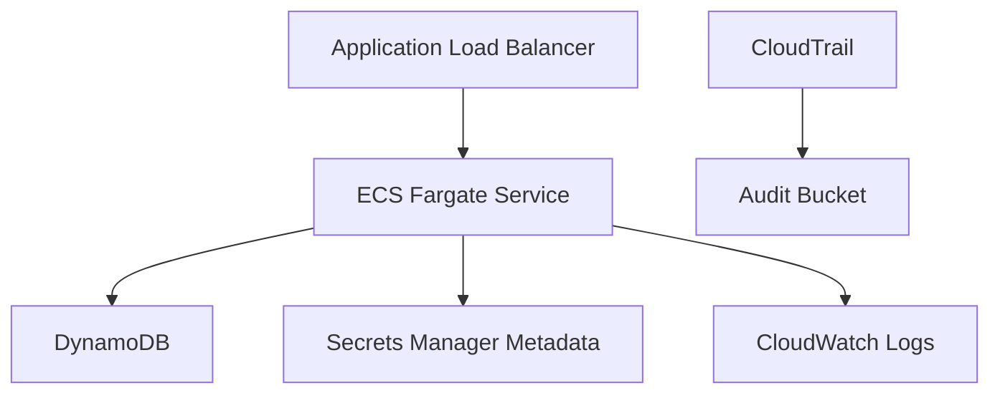

# AWS Reference Architecture

Boundary: Terraform reference architecture only; no apply or resource creation.

Evidence: `infrastructure/README.md`, `outputs/security/infrastructure/evidence-manifest.json`.
