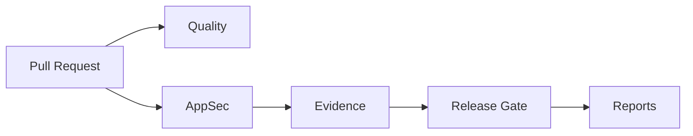

# CI/CD Security Pipeline

```mermaid
flowchart LR
    PR["Pull Request"] --> Quality["Quality"]
    PR --> AppSec["AppSec"]
    AppSec --> Evidence["Evidence"]
    Evidence --> Gate["Release Gate"]
    Gate --> Reports["Reports"]
```

Boundary: GitHub Actions workflow definitions; no production deployment.

Evidence: `.github/workflows/appsec.yml`, `.github/workflows/security-evidence.yml`.
