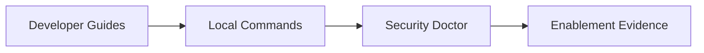

# Developer Enablement Model

```mermaid
flowchart LR
    Guides["Developer Guides"] --> Commands["Local Commands"]
    Commands --> Doctor["Security Doctor"]
    Doctor --> Evidence["Enablement Evidence"]
```

Boundary: local developer guidance and checks.

Evidence: `docs/developer-security/README.md`, `reports/security/developer-enablement-report.md`.
