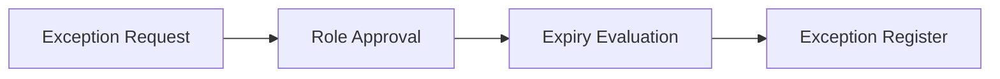

# Exception Governance

```mermaid
flowchart LR
    Request["Exception Request"] --> Approval["Role Approval"]
    Approval --> Expiry["Expiry Evaluation"]
    Expiry --> Register["Exception Register"]
```

Boundary: deterministic local exception records.

Evidence: `docs/security/security-exceptions.md`, `reports/security/security-exception-report.md`.
