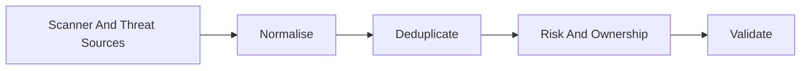

# Finding Normalisation Flow

```mermaid
flowchart LR
    Sources["Scanner And Threat Sources"] --> Normalise["Normalise"]
    Normalise --> Deduplicate["Deduplicate"]
    Deduplicate --> Enrich["Risk And Ownership"]
    Enrich --> Validate["Validate"]
```

Boundary: local finding pipeline.

Evidence: `outputs/security/findings/evidence-manifest.json`.
