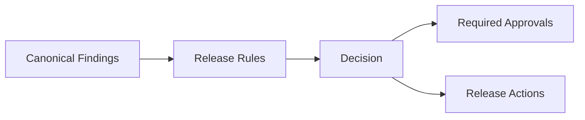

# Release Assurance Flow

```mermaid
flowchart LR
    Findings["Canonical Findings"] --> Rules["Release Rules"]
    Rules --> Decision["Decision"]
    Decision --> Approvals["Required Approvals"]
    Decision --> Actions["Release Actions"]
```

Boundary: local release evaluation only.

Evidence: `outputs/security/release/evidence-manifest.json`.
