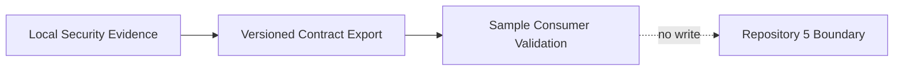

# Repository Integration Boundary

Boundary: contract export and validation only; no Repository 5 modification.

Evidence: `outputs/security/integration/integration-manifest.json`, `docs/integration/repository-5-integration-contract.md`.
