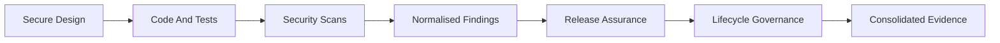

# Secure SDLC

```mermaid
flowchart LR
    Design["Secure Design"] --> Code["Code And Tests"]
    Code --> Scan["Security Scans"]
    Scan --> Findings["Normalised Findings"]
    Findings --> Release["Release Assurance"]
    Release --> Lifecycle["Lifecycle Governance"]
    Lifecycle --> Evidence["Consolidated Evidence"]
```

Boundary: local workflows and CI definitions.

Evidence: `Makefile`, `outputs/security/evidence/evidence-manifest.json`.
