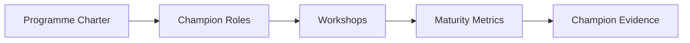

# Security Champions Model

```mermaid
flowchart LR
    Charter["Programme Charter"] --> Champions["Champion Roles"]
    Champions --> Workshops["Workshops"]
    Workshops --> Metrics["Maturity Metrics"]
    Metrics --> Evidence["Champion Evidence"]
```

Boundary: synthetic role-based programme records.

Evidence: `security-champions/README.md`, `outputs/security/champions/evidence-manifest.json`.
