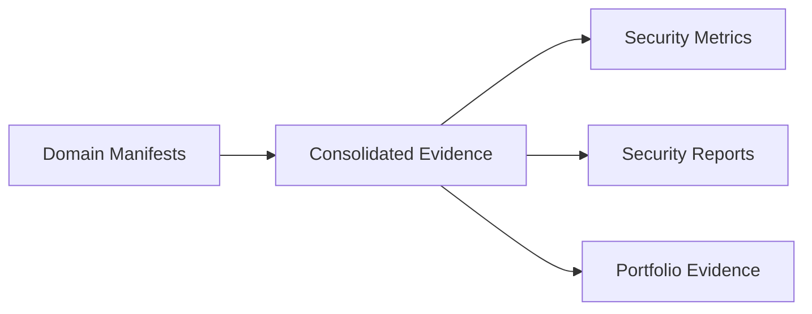

# Security Evidence Flow

```mermaid
flowchart LR
    Manifests["Domain Manifests"] --> Consolidation["Consolidated Evidence"]
    Consolidation --> Metrics["Security Metrics"]
    Consolidation --> Reports["Security Reports"]
    Consolidation --> Portfolio["Portfolio Evidence"]
```

Boundary: repository-local evidence only.

Evidence: `outputs/security/evidence/evidence-manifest.json`, `outputs/security/portfolio/portfolio-manifest.json`.
