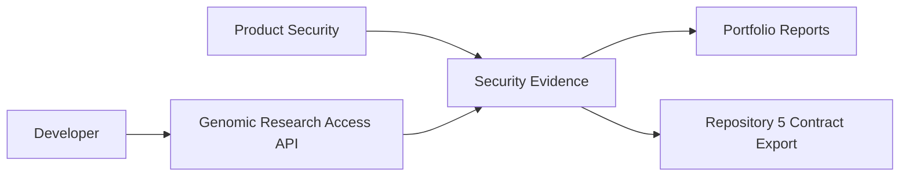

# System Context

Boundary: local repository, local evidence and contract export only.

Evidence: `outputs/security/evidence/evidence-manifest.json`, `outputs/security/portfolio/portfolio-manifest.json`.
