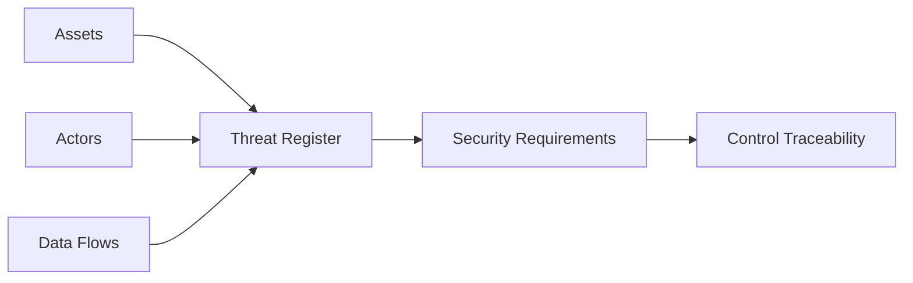

# Threat Model Workflow

```mermaid
flowchart LR
    Assets["Assets"] --> Threats["Threat Register"]
    Actors["Actors"] --> Threats
    Flows["Data Flows"] --> Threats
    Threats --> Requirements["Security Requirements"]
    Requirements --> Traceability["Control Traceability"]
```

Boundary: STRIDE model under `docs/threat-model/`.

Evidence: `outputs/security/threat-model/evidence-manifest.json`.
