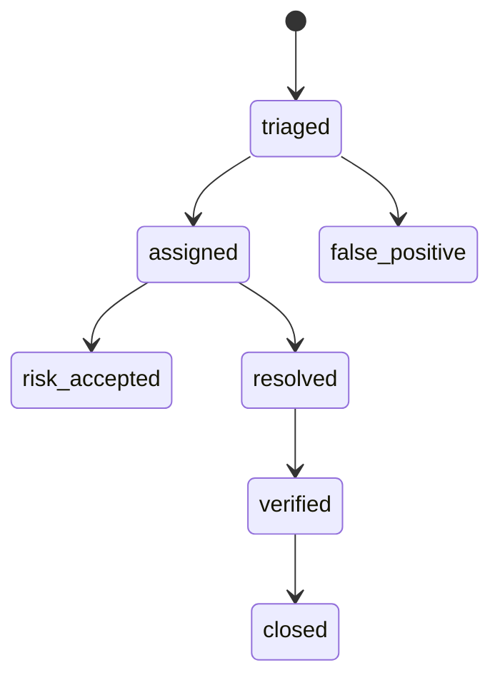

# Vulnerability Lifecycle

```mermaid
stateDiagram-v2
    [*] --> triaged
    triaged --> assigned
    assigned --> risk_accepted
    assigned --> resolved
    resolved --> verified
    verified --> closed
    triaged --> false_positive
```

Boundary: local lifecycle records and exceptions.

Evidence: `outputs/security/lifecycle/evidence-manifest.json`.
