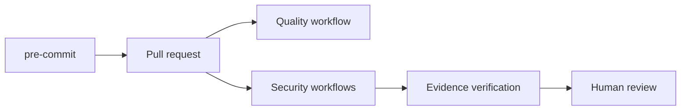

# CI/CD Security Guide

CI/CD guidance supports `SR-CI-001`, `SR-CI-002`, `SR-CI-003`, `SR-DEV-002` and `SR-EVIDENCE-001`.

Workflows use minimal permissions, pinned actions where established, concurrency controls, timeouts and limited artifact retention. They run quality, AppSec, container security, Terraform security, findings, release assurance, lifecycle governance, consolidated evidence and developer enablement. They do not request AWS credentials, deploy resources, push images or scan external targets.

Reusable workflow examples live in `.github/workflows/reusable-quality.yml`, `.github/workflows/reusable-appsec.yml` and `.github/workflows/reusable-security-evidence.yml`. The developer enablement workflow is `.github/workflows/developer-enablement.yml`.

Run `make developer-docs-validate`, `make developer-enablement-full` and `make security-assurance-full` locally before changing workflow behaviour. Success means local evidence and reports match the CI responsibilities. If CI fails, inspect the failing domain, reproduce with the corresponding Make target and fix the underlying control. Do not broaden workflow permissions, add deployment credentials or bypass scanner steps.

