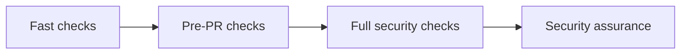

# Local Security Workflow

Choose the smallest workflow that covers the risk of your change. This guide supports `SR-DEV-001`, `SR-DEV-004`, `SR-FINDINGS-001`, `SR-RELEASE-001` and `SR-EVIDENCE-001`.

## Fast Developer Checks

Use this tier while coding. Run `make format`, `make lint`, `make type-check`, `make test` and targeted tests such as `make auth-test` or `make api-security-test`. For application security rules run `make semgrep-test`, `make sast-semgrep` and `make sast-bandit`. Success means the local feedback loop is clean before generated evidence is refreshed.

## Pre-PR Checks

Use this tier before opening a normal pull request. Run `make quality`, `make appsec-fast`, `make findings-full` and `make release-full`. If you changed API boundaries, also run `make dynamic-full`. If you changed lifecycle or exception data, run `make lifecycle-full`.

## Full Security Checks

Use this tier for security-sensitive changes. Run `make appsec-full`, `make dynamic-full`, `make findings-full`, `make release-full`, `make lifecycle-full` and `make evidence-full`. Docker must be available for the full AppSec and dynamic paths. These commands refresh tracked evidence, so review the diff.

## Assurance Checks

Run `make security-assurance-full` when the change affects several domains or before handing off for review. The expected result is passing quality checks, verified domain evidence, generated findings, release, lifecycle and consolidated evidence. Failure means the pull request is not ready; fix the failing domain and rerun the smallest affected target.

