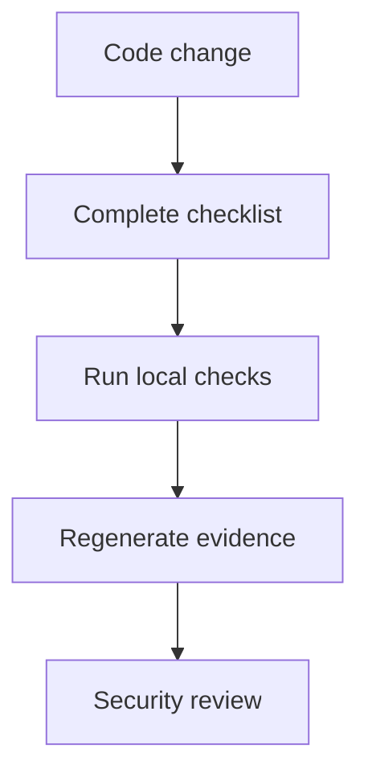

# Pull Request Security Checklist

Use this checklist in pull requests and in `.github/pull_request_template.md`. It supports `SR-DEV-002`, `SR-RELEASE-001`, `SR-LIFECYCLE-003` and `SR-EVIDENCE-001`.

- [ ] Threat-model impact reviewed.
- [ ] Authentication changes reviewed.
- [ ] Authorisation changes reviewed.
- [ ] Object-level access reviewed.
- [ ] Input validation reviewed.
- [ ] Logging reviewed.
- [ ] Secret handling reviewed.
- [ ] Dependency changes reviewed.
- [ ] Terraform changes reviewed.
- [ ] Docker changes reviewed.
- [ ] New endpoints reviewed.
- [ ] New data flows reviewed.
- [ ] New external dependencies reviewed.
- [ ] New suppressions reviewed.
- [ ] New exceptions reviewed.
- [ ] Evidence regeneration completed where required.
- [ ] Release-gate impact reviewed.

Run `make quality` for the minimum repository check. Run `make appsec-fast` when code, dependencies or scanner policy changed. Run `make dynamic-full` for endpoint, authentication, authorisation, CORS, header, rate-limit or OpenAPI changes. Run `make findings-full`, `make release-full`, `make lifecycle-full` and `make evidence-full` when scanner outputs or evidence changed.

Success means the template explains what changed, which checks ran, whether findings were introduced or remediated, whether suppressions or exceptions changed, and what the current release-gate decision means. Do not paste raw scanner output, raw tokens, private keys or real data into the pull request.

