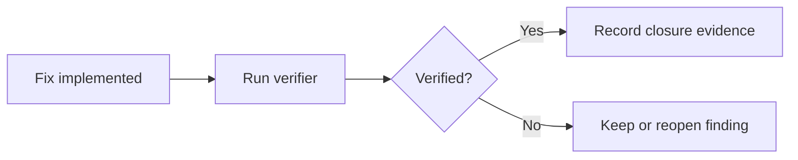

# Remediation Verification Guide

Remediation verification supports `SR-LIFECYCLE-002`, `SR-LIFECYCLE-004`, `SR-EVIDENCE-001` and `SR-DEV-004`.

Resolved means a fix has been implemented. Verified means an independent verifier or deterministic validation has confirmed the fix. Do not close a vulnerability record only because code changed. Use scanner rescan, focused tests, Terraform validation, dynamic evidence, configuration review or consolidated evidence verification as appropriate.

Run the smallest command that proves the fix, then run `make findings-full`, `make release-full`, `make lifecycle-full` and `make evidence-full`. For example, dependency remediation should run `make dependency-audit`, `make sbom`, `make appsec-full` and `make findings-full`. Endpoint remediation should run `make api-security-test` and `make dynamic-full`.

Success means the source finding disappears or is reclassified correctly, lifecycle evidence records verification, release-gate outcome updates and consolidated evidence verifies. Evidence is in `outputs/security/lifecycle/verification-register.json`, `outputs/security/lifecycle/lifecycle-history.json` and `reports/security/verification-report.md`. If verification fails, reopen or keep the vulnerability active and document the next remediation step.

