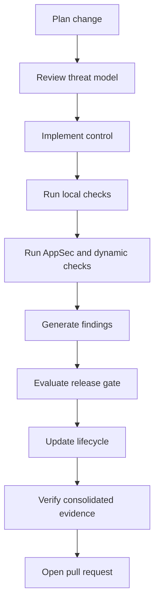

# Secure Development Guide

Use this guide for every feature or fix. The workflow supports `SR-DEV-001`, `SR-DEV-002`, `SR-FINDINGS-001`, `SR-RELEASE-001` and `SR-EVIDENCE-001`.

## Workflow

1. Plan the change. Identify affected endpoints, data flows, roles, Terraform resources, dependencies, Docker layers and generated evidence.
2. Check the threat model. If the change affects a threat, requirement or control, update `docs/threat-model/security-requirements.yaml` and `docs/threat-model/control-traceability.yaml`.
3. Implement with local defaults only. Do not add deployment behaviour, AWS execution, external ticketing, dashboarding or Security Champions workflow.
4. Run fast checks with `make format`, `make lint`, `make type-check` and targeted tests.
5. Run security checks. Use `make appsec-fast` for routine code changes and `make appsec-full` when dependencies, Docker, Terraform or scanner policy changed.
6. Run dynamic checks with `make dynamic-full` when endpoints, schemas, authentication, authorisation, headers, CORS or rate limiting changed.
7. Refresh findings and release evidence with `make findings-full`, `make release-full`, `make lifecycle-full` and `make evidence-full`.
8. For high-risk pull requests run `make security-assurance-full`.

## Expected Outcome

Success means tests pass, scanner summaries are understood, release-gate evidence has no unexpected blockers, lifecycle evidence records current state, and consolidated evidence verifies. Evidence is confirmed by `outputs/security/evidence/evidence-manifest.json`, `reports/security/security-evidence-report.md` and `reports/security/portfolio-assurance-report.md`.

## Failure Handling

Fix the cause first. If a scanner finding is real, remediate it and rerun the relevant scanner. If it is a false positive, use the existing suppression governance with a narrow scope, owner, rationale and expiry. If risk must be accepted temporarily, use the formal exception path in `config/lifecycle/fixtures/lifecycle-overrides.yaml` and verify the release impact with `make release-full`.

