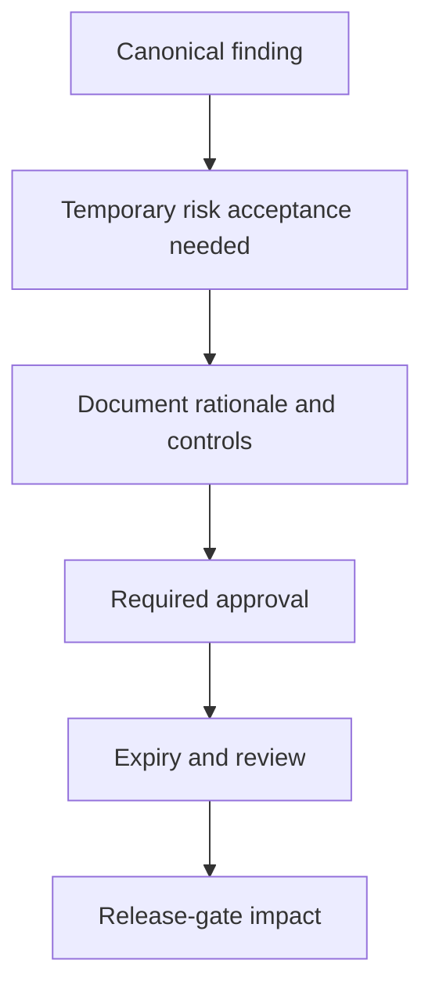

# Security Exception Guide

Exception guidance supports `SR-LIFECYCLE-003`, `SR-LIFECYCLE-004`, `SR-RELEASE-003` and `SR-DEV-004`.

A scanner suppression is narrow handling for scanner noise or a controlled test fixture. A formal security exception is time-bound risk acceptance or deferral for a canonical finding. Exceptions require rationale, owner, approval role, compensating controls, expiry and release-gate awareness. Exceptions always expire; extension requires renewed review.

Use an exception only when remediation cannot happen immediately and the risk is understood. Update lifecycle configuration, run `make lifecycle-full`, then run `make release-full` and `make evidence-full`. Success means `outputs/security/lifecycle/security-exceptions.json` records the exception, expiry status is clear, release evidence reflects conditional approval or blocking impact, and reports are regenerated.

Expired exceptions should reactivate risk, not silently remain accepted. If an exception is revoked, rerun lifecycle and release evidence. Do not use exceptions to bypass tests, hide secrets, excuse missing owners or defer scanner fixes indefinitely.

