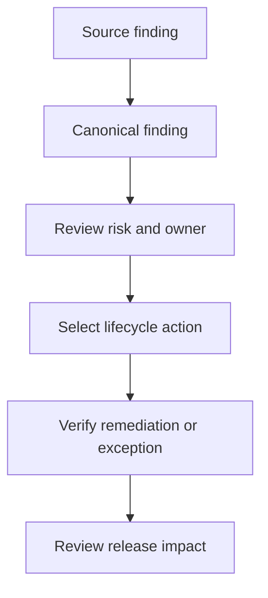

# Vulnerability Triage Guide

Triage guidance supports `SR-FINDINGS-001`, `SR-FINDINGS-003`, `SR-LIFECYCLE-001`, `SR-LIFECYCLE-003` and `SR-RELEASE-001`.

Start with the source finding, then review the canonical record in `outputs/security/findings/deduplicated-findings.json`. Confirm severity, risk score, priority, owner, SLA, source tool, fix availability, suppression state and release impact. Run `make findings-full` after scanner output changes and `make release-full` to see whether the finding blocks, warns or requires conditional approval.

Select the lifecycle action from the current state: assign, remediate, verify, accept risk with a time-bound exception, mark a false positive with evidence, or reopen if verification fails. Run `make lifecycle-full` to regenerate the vulnerability register and exception evidence.

Success means the finding has an owner, priority, due date or accepted-risk record, and release evidence reflects the current decision. Evidence is in `outputs/security/findings/findings-summary.json`, `outputs/security/lifecycle/vulnerability-register.json`, `outputs/security/release/release-gate-decision.json` and `reports/security/vulnerability-remediation-report.md`.

