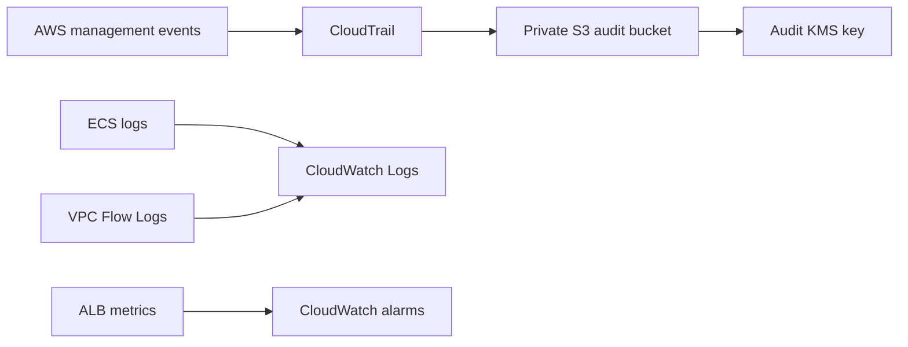

# CloudTrail And Logging

Milestone 4 configures:

- Multi-region CloudTrail.
- Management events.
- Log-file validation.
- KMS encryption.
- Private S3 audit bucket.
- Bucket public-access block.
- Bucket versioning.
- Secure transport bucket policy.
- Lifecycle retention.
- CloudWatch log groups for ECS and VPC Flow Logs.
- Basic ALB and target health alarms.

Data events are not enabled globally to avoid excessive cost. Future deployment reviews should consider targeted data events for evidence buckets, sensitive DynamoDB operations and Secrets Manager.
