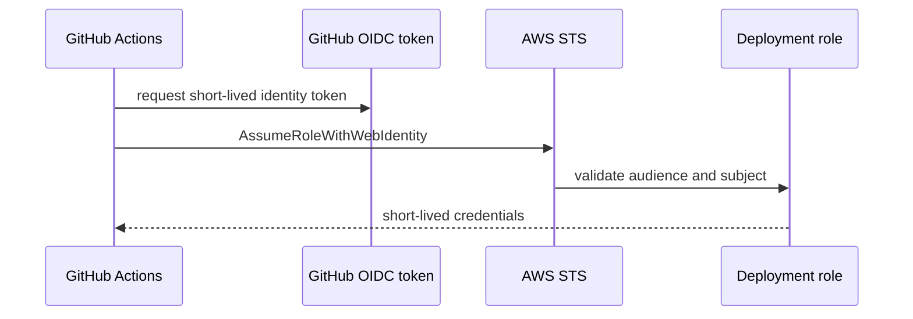

# GitHub Actions OIDC

The IAM module defines a reference deployment role that trusts GitHub Actions through OIDC.

Trust restrictions:

- Federated principal: `token.actions.githubusercontent.com`.
- Audience: `sts.amazonaws.com`.
- Subject: `repo:${github_repository}:${github_ref}`.
- Repository and branch or environment are variables, not personal identifiers.

CI in this repository does not configure AWS credentials yet and does not deploy.
