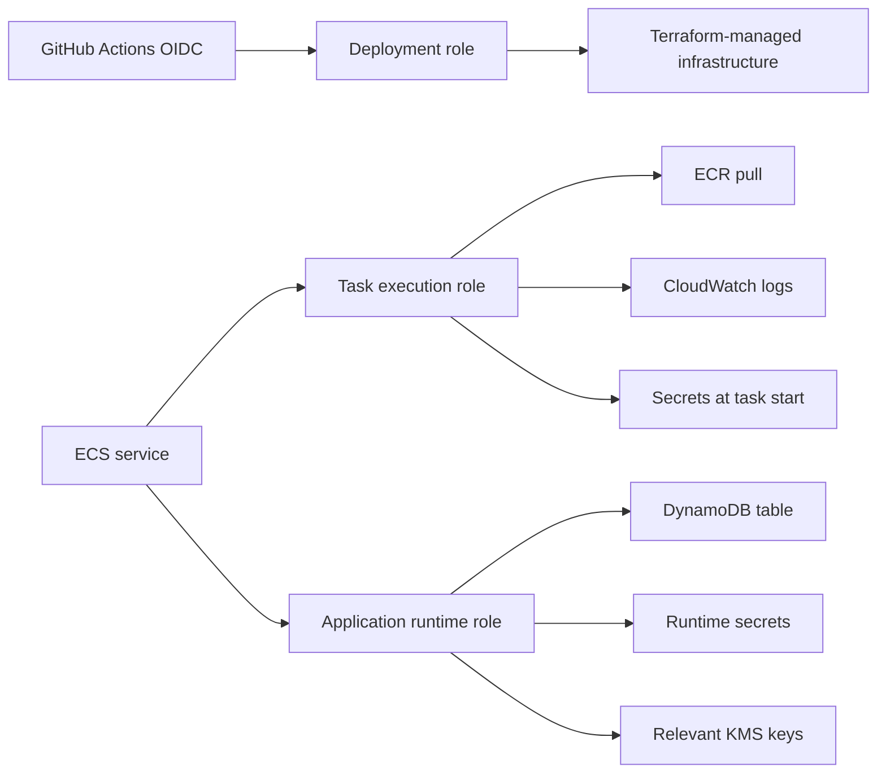

# IAM Model

Milestone 4 separates deployment, task execution and runtime identity.

The roles are not interchangeable:

- Deployment role: manages defined infrastructure through short-lived GitHub OIDC credentials.
- Task execution role: pulls images, writes logs and reads task-start secrets.
- Runtime role: accesses DynamoDB, approved Secrets Manager secrets and relevant KMS keys.
- VPC Flow Logs role: writes flow logs to CloudWatch.

The runtime role does not receive IAM, EC2, S3 administration or deployment permissions.

The deployment role avoids administrator managed policies. Some resources remain `Resource = "*"` because Terraform cannot know all ARNs before bootstrap; those permissions are constrained by service scope, region and future tag governance.
