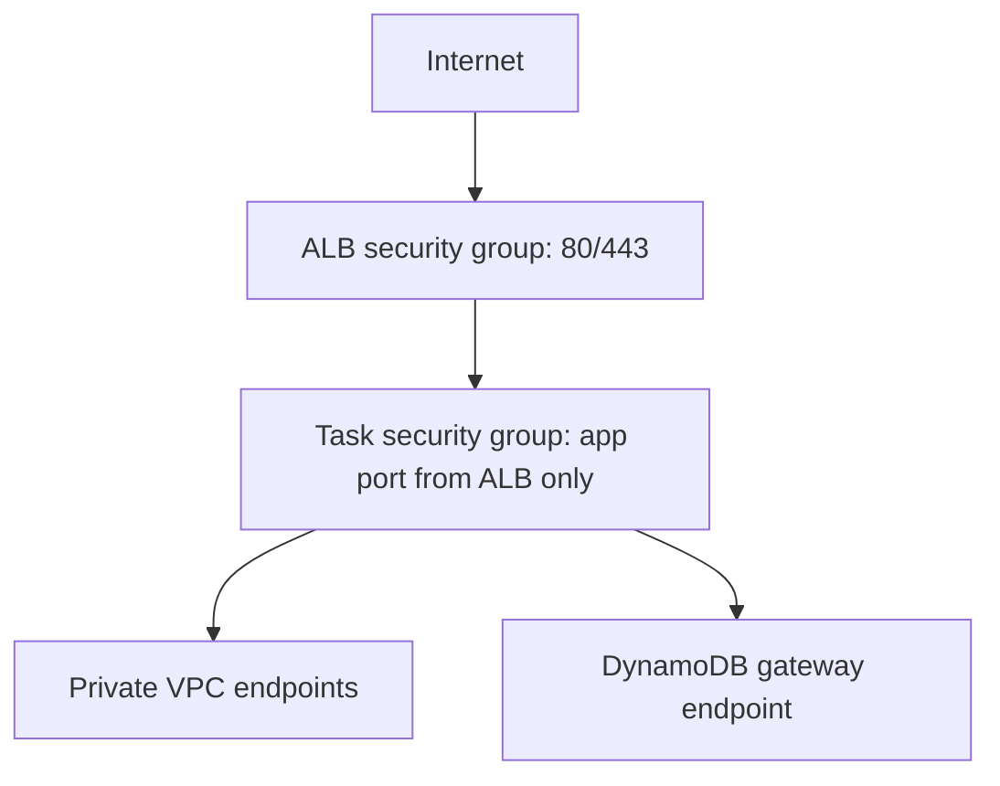

# Network Security

The Terraform networking module defines:

- VPC with DNS support.
- Two or more Availability Zones.
- Public subnets for the Application Load Balancer only.
- Private application subnets for ECS Fargate tasks.
- Internet gateway for ALB ingress.
- Optional NAT gateway input, disabled in the provided dev/prod compositions because VPC endpoints cover required AWS APIs.
- Interface endpoints for ECR API, ECR Docker, CloudWatch Logs and Secrets Manager.
- Gateway endpoints for S3 and DynamoDB.
- VPC Flow Logs to CloudWatch.

Security group intent:

- The ALB accepts public HTTP/HTTPS according to environment configuration.
- ECS tasks accept the application port only from the ALB security group.
- ECS tasks do not receive public IP addresses.
- No SSH ingress exists.
- DynamoDB is not network-public.

