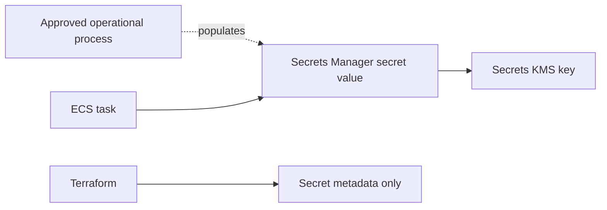

# Secrets Management

Terraform creates Secrets Manager secret metadata only:

- Application configuration secret.
- JWT public-key or key-reference secret.

Terraform does not create `aws_secretsmanager_secret_version` resources and does not commit secret values. Secret values must be populated after provisioning through an approved operational process.

The current local JWT model remains a simulation. Milestone 4 does not implement Cognito, external OIDC discovery or live identity-provider integration.

