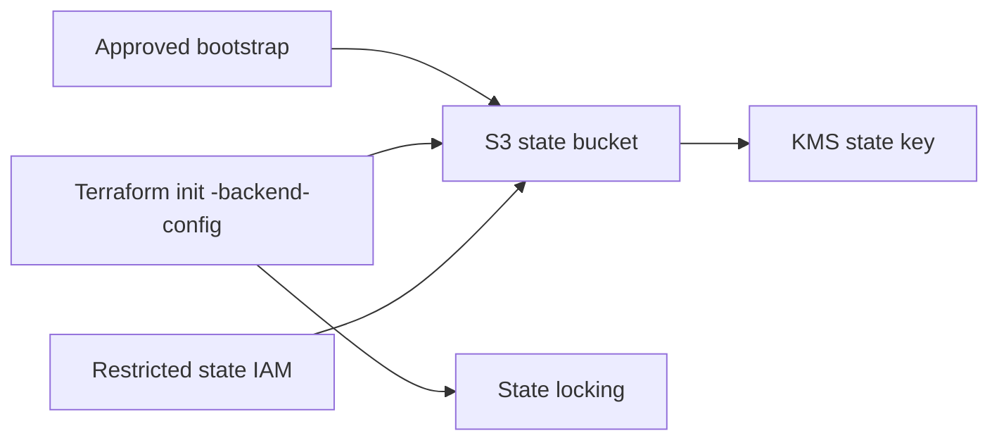

# Terraform State Security

Milestone 4 provides remote-state examples but does not provision or use remote state automatically.

Recommended design:

- Separate state per environment.
- S3 state bucket with KMS server-side encryption.
- Bucket versioning.
- Public-access block.
- Secure transport bucket policy.
- State locking through a dedicated lock table or current Terraform-supported S3 lockfile design.
- Restricted IAM for state read/write.
- Bootstrap performed separately from application infrastructure.
- Recovery process using S3 versioning and controlled KMS access.

Do not commit state files. `.gitignore` excludes `.terraform/`, `*.tfstate`, `*.tfstate.*`, `terraform.tfvars`, `*.auto.tfvars`, crash logs and override files.

