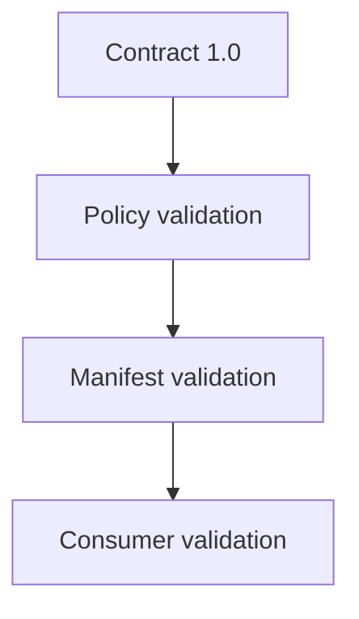

# Compatibility And Versioning

Supported compatibility statuses are:

- `compatible`
- `compatible_with_warnings`
- `incompatible`

Version `1.0` is the initial contract. The repository performs local compatibility
validation only; it does not perform a live Repository 5 compatibility check.

