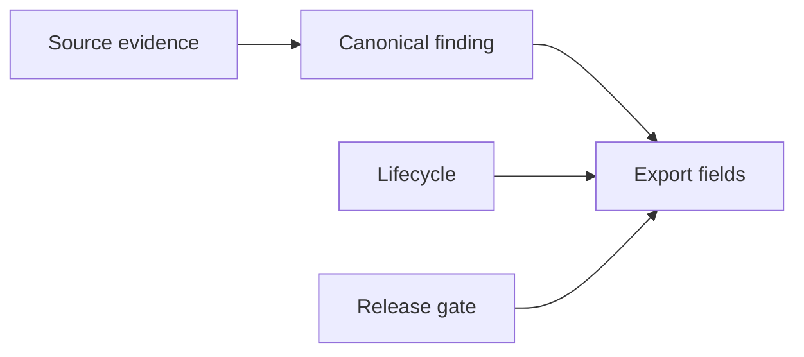

# Field Mapping

Field mappings are defined in `config/integration/field-mapping.yaml`.

The exporter maps repository evidence directly where possible. `export_record_id` is
derived from contract version, canonical finding ID and producer repository using a
12-character SHA-256 prefix.

