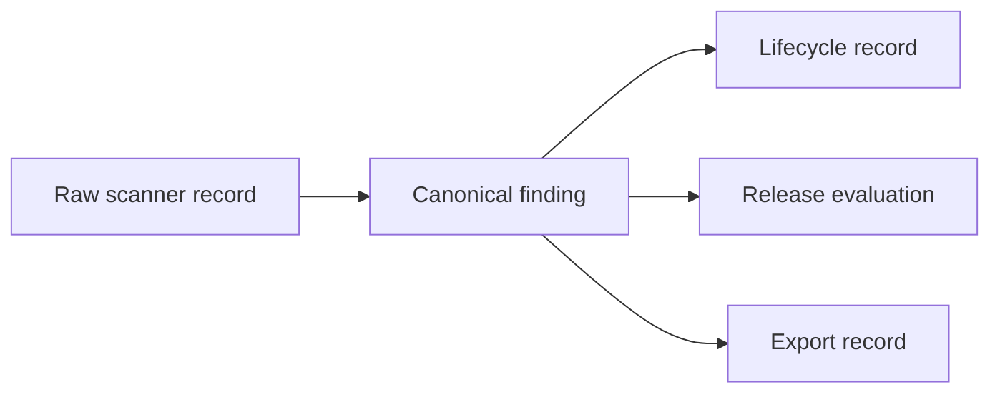

# Lineage And Provenance

`outputs/security/integration/finding-source-lineage.json` records source-to-export
edges:

Every edge includes source ID, target ID, relationship, domains, references and a
SHA-256 checksum.

