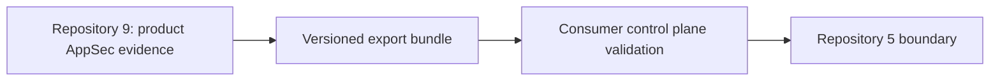

# Repository 5 Integration Contract

Milestone 13 defines a local, deterministic export contract from this repository to a
consumer control plane such as `enterprise-data-saas-security-control-plane`.

It does not modify Repository 5, access Repository 5 internals, deploy anything,
create AWS resources, or transfer data externally.

A consumer control plane can validate and ingest the bundle by verifying the manifest,
checksums, schemas, required fields, record counts, ownership values, lineage edges and
sensitive-content constraints.

The contract is `product-security-control-plane-export` version `1.0`.

