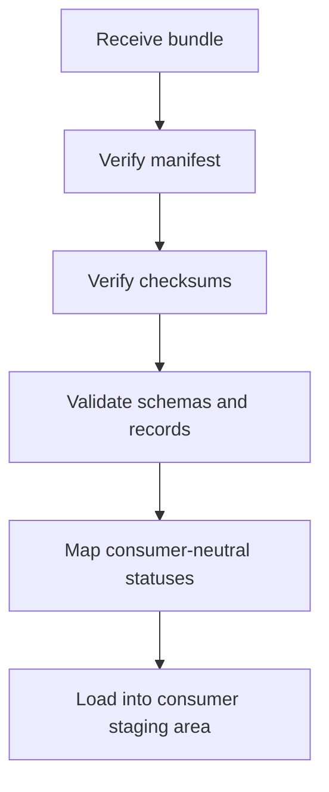

# Sample Ingestion Workflow

This workflow is technology-neutral and local-only.

The final staging/load step is illustrative only. This repository does not implement
Repository 5 code, network transfer, database writes, APIs or queues.

