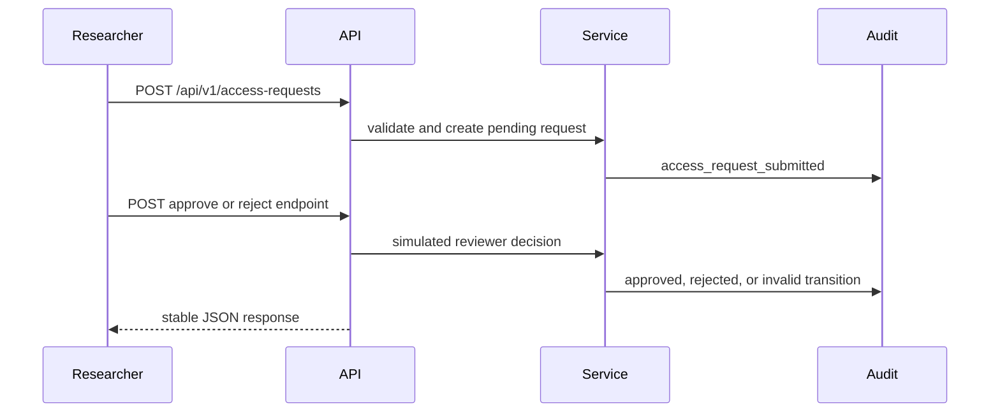

# Milestone 1

Milestone 1 creates the repository foundation and secure reference application for future Product Security and DevSecOps work.

## Delivered

- FastAPI application called Genomic Research Access API.
- Deterministic synthetic dataset catalogue.
- Access request workflow with pending, approved, rejected, and withdrawn enum states.
- Approval and rejection endpoints using a documented simulated local reviewer.
- Structured audit events.
- Central error handling.
- Local testing, quality, Docker, CI, and documentation foundation.

## Workflow

## Out of Scope

Milestone 2 and later capabilities were not implemented. This includes production identity, cloud infrastructure, automated security scanners, vulnerability management, release gates, and Security Champions programme material.
