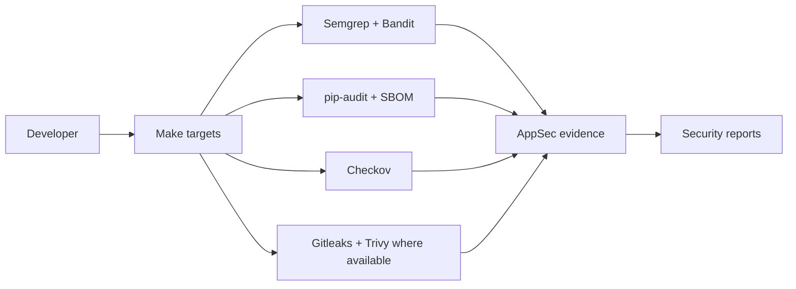

# Milestone 5: Core AppSec Pipeline

Milestone 5 adds local application-security scanner orchestration and deterministic evidence. It does not create cloud resources, publish images, sign artifacts, or implement release gates.

Implemented:

- Pinned scanner inventory and policy files under `security/config/`.
- Gitleaks, Semgrep, Bandit, pip-audit, CycloneDX, Checkov and Trivy wrapper targets.
- Custom Semgrep rules and unit tests.
- Project-scoped runtime dependency audit with vulnerable FastAPI/PyJWT/Starlette pins remediated.
- Deterministic CycloneDX SBOM fallback and AppSec evidence manifest.
- Markdown reports under `reports/security/`.
- SHA-pinned AppSec, container-security and Terraform-security GitHub Actions workflows.

Local limitation:

- Docker is required for Gitleaks and Trivy container fallbacks when native binaries are not installed.
- Checkov currently reports Terraform findings and does not suppress them.

