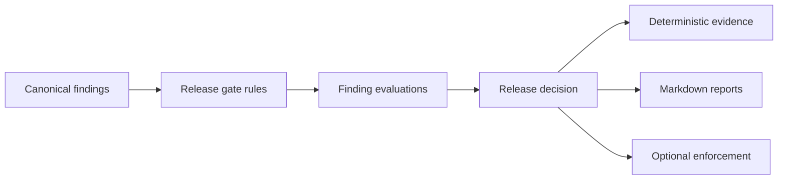

# Milestone 8: Risk-Based Release Gates

Milestone 8 adds deterministic release-assurance gates over Milestone 7 canonical findings.

Implemented:

- Versioned release policy, gate rules, environment policy, approval policy and severity override config under `config/release/`.
- A typed release package under `src/genomic_research_access_api/security/release/`.
- Release evidence under `outputs/security/release/`.
- Release reports under `reports/security/`.
- Evidence-mode and enforcement-mode CLI commands.
- Approval fixtures for none, partial, complete, invalid and no-required approval scenarios.
- A CI workflow that validates release assurance in evidence mode only.

Not implemented:

- Formal exception workflow.
- Enterprise vulnerability lifecycle.
- Deployment approval system.
- AWS deployment.
- Container push.
- Artefact signing or provenance.



Core commands:

```bash
make release-policy-validate
make release-gate-evaluate
make release-evidence
make verify-release-evidence
make release-report
make release-full
make release-gate-enforce
```
