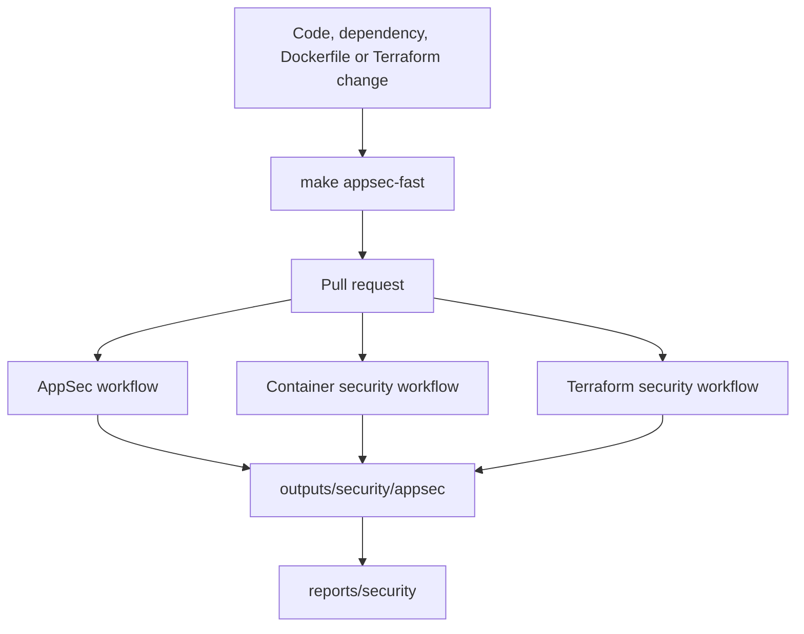

# Security Pipeline

The local security pipeline is Makefile-driven so developers can run the same checks advertised by CI.



Core commands:

```bash
make security-tools
make semgrep-test
make sast
make sca
make checkov-scan
make appsec-evidence
make verify-appsec-evidence
make appsec-report
```

Docker-backed commands:

```bash
make secrets-scan
make container-build-security
make container-scan
```
