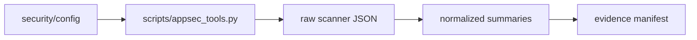

# AppSec Policy

Policy inputs live under `security/config/`.

- `tools.yaml` pins scanner versions and container fallbacks.
- `policy.yaml` records scanner policy intent.
- `severity-thresholds.yaml` documents blocking thresholds.
- `suppressions.yaml` is the governed suppression register.

No broad repository-wide scanner waiver is used for Milestone 5. Checkov findings are captured as evidence instead of being hidden.

