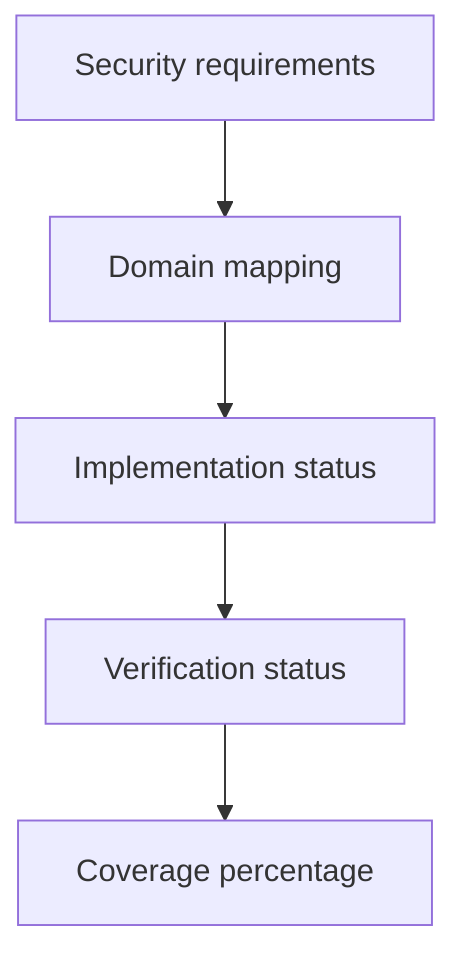

# Control Coverage

Control coverage is aggregated from validated threat-model security requirements and written to:

- `outputs/security/evidence/control-coverage.json`
- `outputs/security/evidence/control-coverage.csv`

Deployment-dependent Terraform controls remain `implemented_as_code` or `validated_locally`; they are not described as operational production controls.
