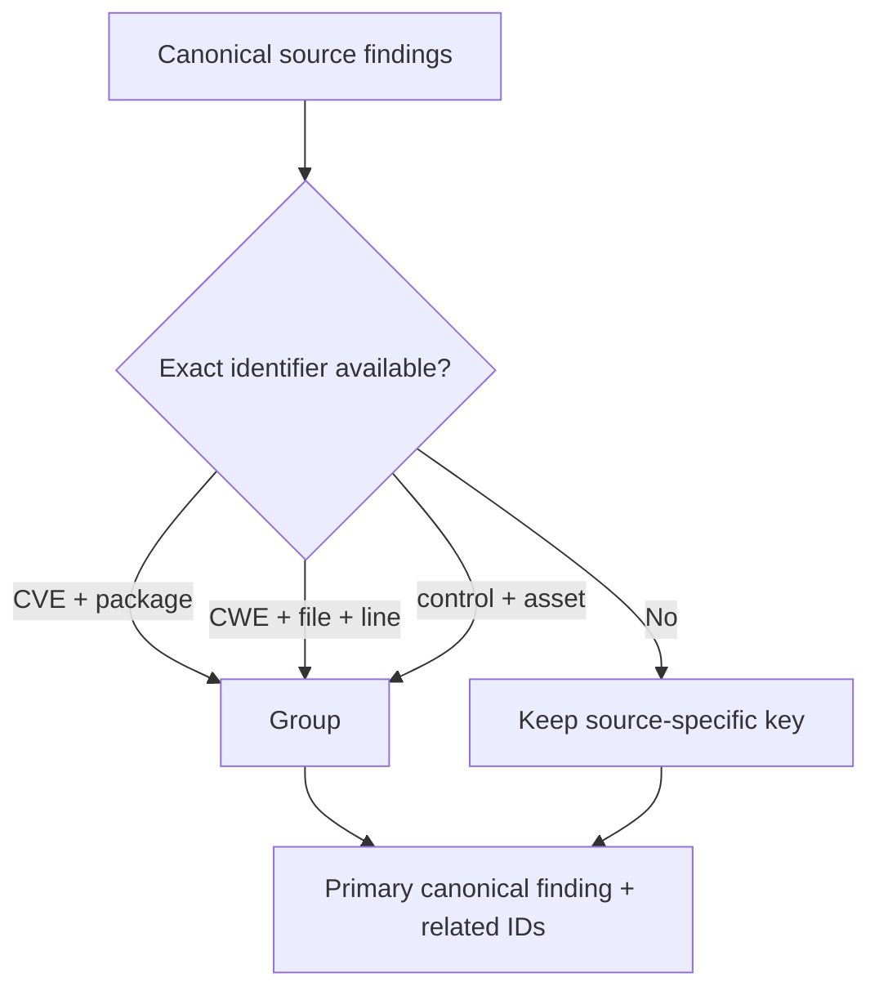

# Deduplication

Deduplication is deterministic and exact-key based. It uses CVE + package, CWE + file + line, control + asset, or source-specific stable keys before any title comparison.

No fuzzy matching, probabilistic matching or machine-learning matching is used. Raw evidence is never deleted; duplicate source records are linked in `finding-source-map.json`.

