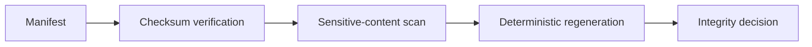

# Evidence Integrity

Consolidated verification checks:

- Required source manifests exist.
- Required source outputs exist.
- Source output checksums match.
- Consolidated output checksums match.
- Regeneration is deterministic.
- Consolidated outputs do not contain local absolute paths, raw JWTs, private keys or high-confidence secret patterns.

