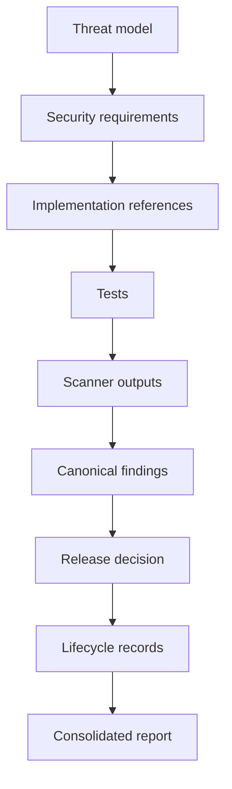

# Evidence Lineage

Milestone 10 writes lineage to `outputs/security/evidence/evidence-lineage.json`.

Lineage edges include source and target references, relationships, control IDs, threat IDs and security requirement IDs where repository artefacts support them.
