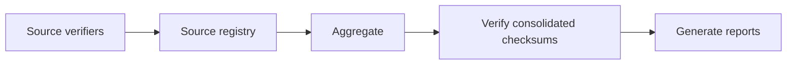

# Evidence Verification

Use:

```bash
make evidence-source-validate
make evidence-generate
make verify-consolidated-evidence
make evidence-report
make evidence-full
```



`evidence-full` does not require Docker when existing source evidence is present and verified.
