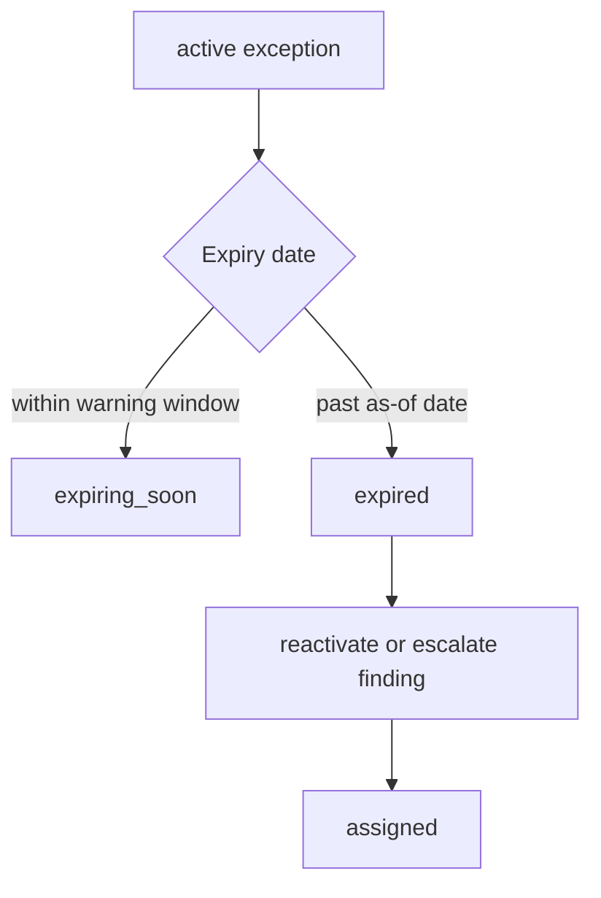

# Exception Expiry

Exception expiry is evaluated with `LIFECYCLE_AS_OF_DATE` or the deterministic default in lifecycle policy.

```bash
make lifecycle-expiry
```



Expired exceptions are exported to `outputs/security/lifecycle/expired-exceptions.csv`. Expiring exceptions are exported to `outputs/security/lifecycle/expiring-exceptions.csv`.
